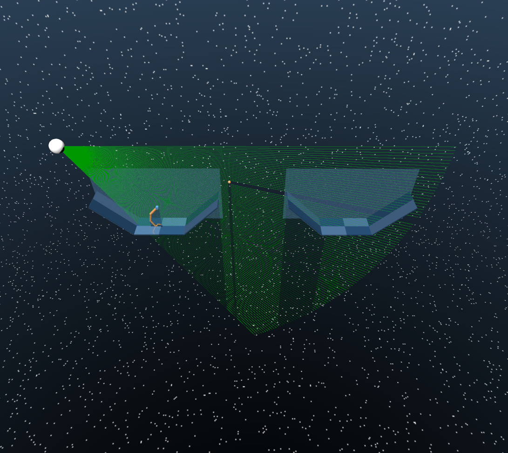

# Catching Dynamics


**CS 275 Artificial Life Course Project**  
Griffin Galimi¹, Soham Patil², Jerry Yao¹  
¹Computer Science Department, UCLA  
²Mathematics Department, UCLA  

## Overview

This project presents a reinforcement learning framework for simulating **dynamic catching and throwing** using a 2D robotic arm in the MuJoCo physics engine. Inspired by biological sensorimotor control, our agent learns to intercept and secure a moving object through interaction with its environment, rather than hardcoded rules.

The work highlights the emergence of timing-sensitive behaviors through reward shaping, perception, and policy learning in a physics-based setting. It also introduces a biologically motivated vision system using ray-based sensors and a hybrid CNN-LSTM inference model with a learned gating mechanism.

## Features

- **2D Catching and Throwing Simulation** using MuJoCo
- **Multi-joint Robotic Arm** with tendon-based grasper
- **Custom Environments** for throwing, catching, and dual-arm interaction
- **Biologically Inspired Visual Perception**
  - 1D ray-based visual system
  - CNN for spatial recognition
  - LSTM for temporal inference
  - Learned gating for prediction fusion
- **Reinforcement Learning via Ray RLlib**
  - PPO algorithm
  - PyTorch backend

## Getting Started

### Prerequisites

- Python ≥ 3.8
- [MuJoCo](https://mujoco.org/)
- [Gymnasium](https://github.com/Farama-Foundation/Gymnasium)
- [Ray RLlib](https://docs.ray.io/en/latest/rllib/)
- [PyTorch](https://pytorch.org/)
- NumPy, matplotlib, etc.

### Installation

```bash
git clone https://github.com/griffing52/catching_dynamics.git
cd catching_dynamics
pip install -r requirements.txt
```

## Results

The arm learns to:

* **Catch**: Track and align with a falling ball using wrist orientation and precise timing.
* **Throw**: Develop a pinch-launch motion to achieve distance and trajectory goals.
* **Perceive**: Use a CNN-LSTM model with learned gating to infer object motion from ray-based vision, even during partial occlusion.

Figures and demo videos can be found in the [`images/`](images/) and [`videos/`](videos/) directories.

<!--  -->


---

## Future Work

* End-to-end coordinated catching and throwing
* Dynamic camera/eye system
* 3D environment extension
* Adversarial or collaborative multi-agent training
* Muscle-based actuation for biomimetic realism

---

## Reference

This project was completed as part of **CS 275: Artificial Life** at UCLA (June 2025).
For detailed methodology and experiments, see our full [project report](submission/report.pdf).

---

## Acknowledgements

* [Farama Gymnasium Robotics](https://github.com/Farama-Foundation/Gymnasium-Robotics)
* [MuJoCo](https://mujoco.org/)
* [Ray RLlib](https://docs.ray.io/en/latest/rllib/)
* [PyTorch](https://pytorch.org/)

---

*This project was inspired by biological systems’ seamless integration of perception and control—and strives to bridge that gap in synthetic agents.*
